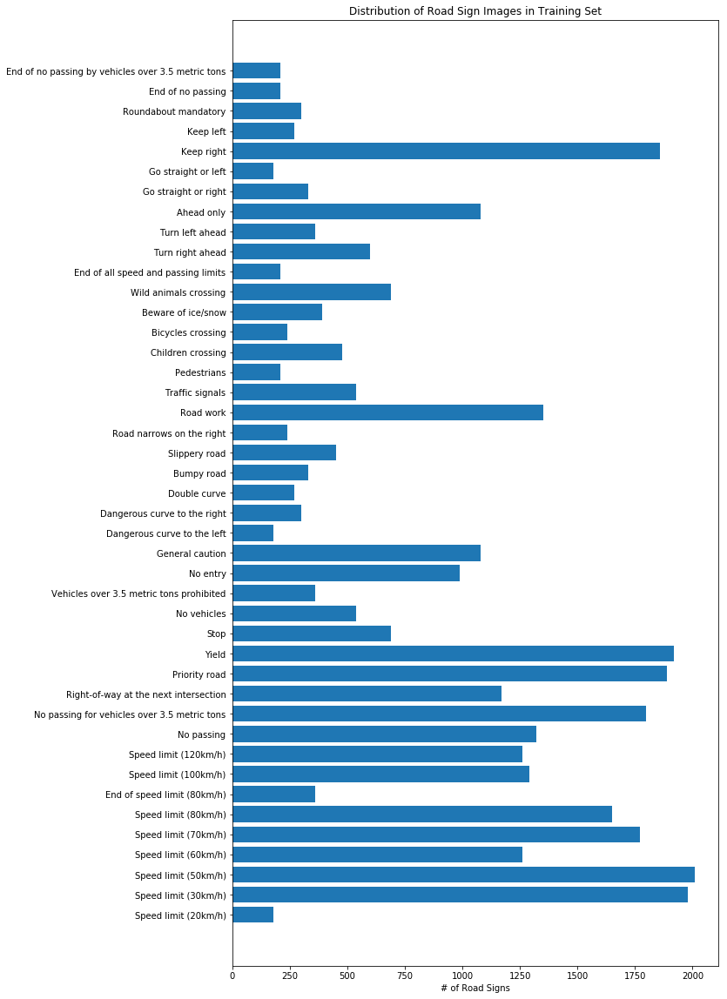
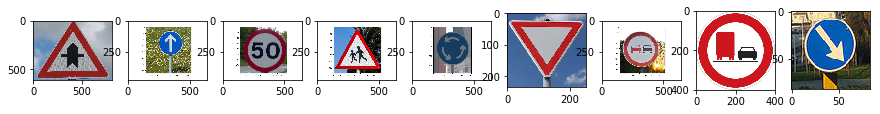

# Self-Driving Car Engineer Nanodegree

## Deep Learning

## Project 2: Build a Traffic Sign Recognition Classifier

The goal of Project 2 was to build a convolutional neural network, using python and tensorflow, to classify German traffic signs. This project utilized data from [German Traffic Sign Dataset](http://benchmark.ini.rub.de/?section=gtsrb&subsection=dataset), provided by udacity in addition to starter code included here: 

    https://github.com/udacity/CarND-Traffic-Sign-Classifier-Project


The data set included 34799 training images, 4410 validation images, and 12630 testing images. All example images were preformatted to a size of (32,32,3).

Figure 1 shows a sample of images for the training data. Figure 2 shows the distribution of traffic signs by label/type in the training data. 

#####  Figure1. Training Sample Images


#####     Figure 2. Distribution of Road Sign Images




### Data Preprocesseing

Preprocessing of the data included:
    1. converting the images to grayscale,
    2. using histogram equalization to 'brighten' the overall image
    3. smoothing the image, using Gaussian blur, and
    4. normalizing the image by the function (pixel - 128)/128

Previous preprocessing attempts included converting to HSV color space and using the H-channel, warping the images, rotating the images randomly from -45 deg to +45 deg, "zooming" ROI (taking randomly located regions of interest and increasing the size to 32x32 pixels), and normalization using the function (pixel * 0.8/255) + 0.1. However, these preprocessing steps either reduced the overall validation accuracy or had no affect on the validation accuracy, so they were not used here. 

### Model Architecture

Originally the LeNet-5 achitecture from the [LeNet-5 Lab](http://classroom.udacity.com/nanodegrees/nd013/parts/fbf77062-5703-404e-b60c-95b78b2f3f9e/modules/6df7ae49-c61c-4bb2-a23e-6527e69209ec/lessons/601ae704-1035-4287-8b11-e2c2716217ad/concepts/d4aca031-508f-4e0b-b493-e7b706120f81) was used. Several hyperparameters were changed and the activation function was changed, however, repeated results were unsatisfactory. Therefore the LeNet model architecture was adjusted slightly. First an additional convolutional layer was added. Then a fullly connected layer was removed. Dropouts were added to reduce overfitting of the data. 

| Layer No  | Functions     |Dimensions                                   |
|-----------|---------------|---------------------------------------------|
|Layer1:    |Conv           |kernel = 3x3, strides=1, output = (28,28, 6) |
|           |Sigmoid        |                                             |
|           |Max_Pool       |kernel = 3x3, strides =1, output = (26,26, 6)|
|Layer2:    |Conv           |kernel = 3x3, strides=2, output = (12,12,16) |
|           |Sigmoid        |                                             |  
|           |Max_Pool       |kernel = 2x2, strides=1, output = (11,11, 16)|
|Layer3:    |Conv           |kernel = 4x4, strides=2, output = (4,4,25)    |
|            |Sigmoid        |
|            |Dopout         |keep_prob = 0.6            |
|Layer4:    |Fully Connect  |Flattened = 400            |
|            |Matrix Multiply|output = 120   |   
|            |Sigmoid        |                                               |
|            |Dropout        |keep_prob = 0.8                |
|Layer5:    |Fully Connect  |                                               |
|            |Matrix Multiply |output = 43                                   |        


```python
### Define your architecture here.
### Feel free to use as many code cells as needed.


''' 
    *Adapted LeNet-5  architecture from LeNet lab
    *Added convolutional layer and removed the final fully-connected layer
    *Activation function: using sigmoid instead of relu
    *added dropouts after Layers 3 and 4  with keep_prob= 0.6 and 0.8 respectively

''' 

from tensorflow.contrib.layers import flatten

keep_prob = tf.placeholder(tf.float32)

def LeNet(x):    
    # Arguments used for tf.truncated_normal, randomly defines variables for the weights and biases for each layer
    mu = 0
    sigma = 0.1
   
    
    # SOLUTION: Layer 1: Convolutional. Input = 32x32x1. Output = 28x28x6.
    conv1_W = tf.Variable(tf.truncated_normal(shape=(5, 5, 1, 6), mean = mu, stddev = sigma))
    conv1_b = tf.Variable(tf.zeros(6))
    conv1   = tf.nn.conv2d(x, conv1_W, strides=[1, 1, 1, 1], padding='VALID') + conv1_b
  
    # SOLUTION: Activation.
    #conv1 = tf.nn.relu(conv1)
    conv1 = tf.nn.sigmoid(conv1)
    
    # SOLUTION: Pooling. Input = 28x28x6. Output = 26x26x6.
    conv1 = tf.nn.max_pool(conv1, ksize=[1, 3, 3, 1], strides=[1, 1, 1, 1], padding='VALID')
    
    
    # SOLUTION: Layer 2: Convolutional. Output = 12x12x16.
    conv2_W = tf.Variable(tf.truncated_normal(shape=(3, 3, 6, 16), mean = mu, stddev = sigma))
    conv2_b = tf.Variable(tf.zeros(16))
    conv2   = tf.nn.conv2d(conv1, conv2_W, strides=[1, 2, 2, 1], padding='VALID') + conv2_b
        
    # SOLUTION: Activation.
    #conv2 = tf.nn.relu(conv2)
    conv2 = tf.nn.sigmoid(conv2)
    
    # SOLUTION: Pooling. Input = 12x12x16. Output = 11x11x16.
    conv2 = tf.nn.max_pool(conv2, ksize=[1, 2, 2, 1], strides=[1, 1, 1, 1], padding='VALID')
    #conv2 = tf.nn.dropout(conv2, keep_prob[1])
    
    # SOLUTION: Layer 3: Convolutional. Output = 4x4x25.
    conv3_W = tf.Variable(tf.truncated_normal(shape=(4, 4, 16, 25), mean = mu, stddev = sigma))
    conv3_b = tf.Variable(tf.zeros(25))
    conv3   = tf.nn.conv2d(conv2, conv3_W, strides=[1, 2, 2, 1], padding='VALID') + conv3_b
   
    # SOLUTION: Activation.1
    #conv3 = tf.nn.relu(conv3)
    conv2 = tf.nn.sigmoid(conv2)
    conv3 = tf.nn.dropout(conv3, keep_prob[1])
        
    # SOLUTION: Flatten. Input = 4x4x25. Output = 400.
    fc0   = flatten(conv3)
    
    # SOLUTION: Layer 4: Fully Connected. Input = 400. Output = 120.
    fc1_W = tf.Variable(tf.truncated_normal(shape=(400, 120), mean = mu, stddev = sigma))
    fc1_b = tf.Variable(tf.zeros(120))
    fc1   = tf.matmul(fc0, fc1_W) + fc1_b
    
    # SOLUTION: Activation.
    #fc1    = tf.nn.relu(fc1)
    fc1= tf.nn.sigmoid(fc1)
    fc1 = tf.nn.dropout(fc1, keep_prob[0])
    
    # SOLUTION: Layer 5 Fully Connected. Input = 120. Output = 84.
    fc2_W  = tf.Variable(tf.truncated_normal(shape=(120, 43), mean = mu, stddev = sigma))
    fc2_b  = tf.Variable(tf.zeros(43))
    fc2 = tf.matmul(fc1, fc2_W) + fc2_b
    return fc2

```
### Training, Validation, and Testing the Model

Training was done using the following parameters:

   |Hyperparameters| Values         |
   |---------------|------------------|
   |Epochs      | 100            |
   |Batch Size      |  128          |
   |Learning Rate | 0.0008          |
   |keep_prob       |   0.5 (dropout, in Layer 3)|
   |                |   0.8 (dropout, in Layer 4)|

At Epoch 100 the training accuracy = 98.2% and the validation accuracy = 94.7%. 

Finally, the data used for testing had an accuracy = 91.0%


#### Figure 3. Plot of Triaing and Validation Accuracies


### Testing New Images

Nine images of German traffic signs were found on the web, four of which were chosen because the training set contained a high distribution of images ( > 1750) in their category. These images were tested using the above model. The accuracy of the sample images was low, 55%. The top five predicted labels, for each input sample image, and their respective probabilities are shown below. 

   #### Figure 4. Sample Images From the Web




Label No   | Labels of Top 5 Prob	|   Top 5 Probablity
---------  |---------------------	| --------------------
11         | 11, 30, 1, 23, 34, 	| 0.995088, 0.00476277, 4.89119e-05, 3.8882e-05, 1.66087e-05
35		   | 3, 5, 7, 2, 18			    | 0.432789, 0.279815, 0.177555, 0.0898853, 0.00846187
2		   | 8, 7, 2, 5, 1			    | 0.721362, 0.270504, 0.00672228, 0.000683435, 0.000379537
28		   | 24, 27, 31, 21, 29			| 0.928501, 0.064805, 0.00160601, 0.00130281, 0.000851723
40		   | 12, 8, 29, 0, 3			| 0.789539, 0.0774068, 0.0503172, 0.0417466, 0.0109882
13		   | 13, 9, 10, 38, 15			| 0.999941, 5.85875e-05, 2.75398e-07, 7.69311e-08, 2.41203e-08
9		   | 9, 12, 3, 7, 35			| 0.598603, 0.329727, 0.0334712, 0.0229883, 0.00696638
10		   | 29, 12, 13, 28, 5			| 0.929725, 0.0226146, 0.0189356, 0.0115063, 0.0109912
38		   | 38, 10, 13, 5, 2			| 0.778025, 0.20454, 0.01382, 0.00303242, 0.000336547


Of the nine sample images only four were correctly classified: had a matching label with the highest probability. These were 'Right of Way', (label = 11), 'Yield' (label = 13), 'No Passing' (label = 9), and 'Keep Right' (label = 38). Since only two of those correcly classified had high numbers in the training data, it appears that the number of images per label in the training data did not have an impact in correct classification in using this model.  

For the input sample 'Speed 50 kph' (label = 2), the model classified this image as being a speed sign, with all top five classification being spped signs. This is likely due to the general shape and overall color of the signs: round and white with red circle on the edges, but only listed label 2 as it's third highest probability, at less than 1%.


