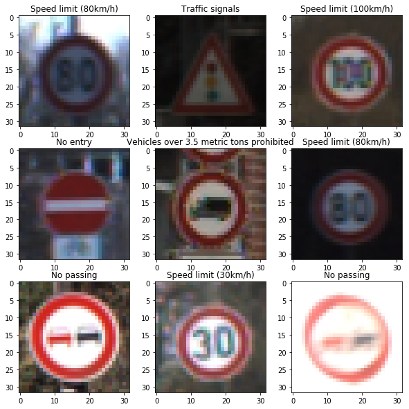
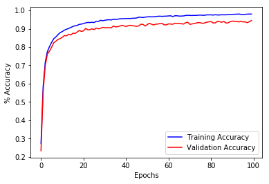

# Self-Driving Car Engineer Nanodegree

## Deep Learning

## Project: Build a Traffic Sign Recognition Classifier

The Goal of Project 2 was to build a convolutional neural network, using python and tensorflow, to classify German traffic signs. This project utilized data obtainable from [German Traffic Sign Dataset](http://benchmark.ini.rub.de/?section=gtsrb&subsection=dataset), and provided by udacity as well as starter code included here: 

    https://github.com/udacity/CarND-Traffic-Sign-Classifier-Project


The data set included 34799 training example images, 4410 validation examples, and 12630 testing examples. All example images were preformated to a size of (32,32,3).

The figure 1 below is sample of images for the training data. Figure 2 show the distribution of traffic sign types in the training data. 

###   Figure1. Training Sample Images




###     Figure 2. Distribution of Road Sign Images


### Data Preprosseing

Preprossessing of the data included:
    1. Converting the images to grayscale, using openCV cvtColor() function
    2. Histogram equalization to 'brighten' the overall image
    3. Blurring the image using the openCV function GaussianBlur()
    4. Normalizing the image by the function (pixel -128)/128

Previous preprossessing attempts included converting to HSV color space and using the H-channel, warping the images, rotating the images randomly from -45 deg to +45 deg, 'zooming' (taking random region of interests and increasing the size to 32x32 pixels), and normalizing with function (pixel *0.8/255) + 0.1. However, these either reduced the overall validation accuracy or had no affect. 


### Model Architecture

The original architecture used the LeNet-5 Lab https://classroom.udacity.com/nanodegrees/nd013/parts/fbf77062-5703-404e-b60c-95b78b2f3f9e/modules/6df7ae49-c61c-4bb2-a23e-6527e69209ec/lessons/601ae704-1035-4287-8b11-e2c2716217ad/concepts/d4aca031-508f-4e0b-b493-e7b706120f81. Several hyperparameters and the activation function changed, however, the results were unsatisfactor and the model architecture was adjusted slightly. The following achitecture was used:


Layer1:     Conv            kernel = 3x3, strides=1, output = (28,28, 6)
            Sigmoid
            Max_Pool        kernel = 3x3, strides =1, output = (26,26, 6)

Layer2:     Conv            kernel = 3x3, strides=2, output = (12,12,16)
            Sigmoid
            Max_Pool        kernel = 2x2, strides=1, output = (11,11, 16)
            
Layer3:     Conv            kernel = 4x4, strides=2, output = (4,4,25)    
            Sigmoid
            Dopout          keep_prob = 0.6

Layer4:     Fully Connect   Flattened = 400
            Matrix Multi    output = 120
            Sigmoid
            Dropout         keep_prob = 0.8

Layer5:     Fully Connect   
            Matrix Multi    output = 43


```python
### Define your architecture here.
### Feel free to use as many code cells as needed.


''' 
    *Adapted LeNet-5  architecture from LeNet lab
    *Added convolutional layer and removed the final fully-connected layer
    *Activation function: using sigmoid instead of relu
    *added dropouts after Layers 3 and 4  with keep_prob= 0.6 and 0.8 respectively

''' 

from tensorflow.contrib.layers import flatten

keep_prob = tf.placeholder(tf.float32)

def LeNet(x):    
    # Arguments used for tf.truncated_normal, randomly defines variables for the weights and biases for each layer
    mu = 0
    sigma = 0.1
   
    
    # SOLUTION: Layer 1: Convolutional. Input = 32x32x1. Output = 28x28x6.
    conv1_W = tf.Variable(tf.truncated_normal(shape=(5, 5, 1, 6), mean = mu, stddev = sigma))
    conv1_b = tf.Variable(tf.zeros(6))
    conv1   = tf.nn.conv2d(x, conv1_W, strides=[1, 1, 1, 1], padding='VALID') + conv1_b
  
    # SOLUTION: Activation.
    #conv1 = tf.nn.relu(conv1)
    conv1 = tf.nn.sigmoid(conv1)
    
    # SOLUTION: Pooling. Input = 28x28x6. Output = 26x26x6.
    conv1 = tf.nn.max_pool(conv1, ksize=[1, 3, 3, 1], strides=[1, 1, 1, 1], padding='VALID')
    
    
    # SOLUTION: Layer 2: Convolutional. Output = 12x12x16.
    conv2_W = tf.Variable(tf.truncated_normal(shape=(3, 3, 6, 16), mean = mu, stddev = sigma))
    conv2_b = tf.Variable(tf.zeros(16))
    conv2   = tf.nn.conv2d(conv1, conv2_W, strides=[1, 2, 2, 1], padding='VALID') + conv2_b
        
    # SOLUTION: Activation.
    #conv2 = tf.nn.relu(conv2)
    conv2 = tf.nn.sigmoid(conv2)
    
    # SOLUTION: Pooling. Input = 12x12x16. Output = 11x11x16.
    conv2 = tf.nn.max_pool(conv2, ksize=[1, 2, 2, 1], strides=[1, 1, 1, 1], padding='VALID')
    #conv2 = tf.nn.dropout(conv2, keep_prob[1])
    
    # SOLUTION: Layer 3: Convolutional. Output = 4x4x25.
    conv3_W = tf.Variable(tf.truncated_normal(shape=(4, 4, 16, 25), mean = mu, stddev = sigma))
    conv3_b = tf.Variable(tf.zeros(25))
    conv3   = tf.nn.conv2d(conv2, conv3_W, strides=[1, 2, 2, 1], padding='VALID') + conv3_b
   
    # SOLUTION: Activation.1
    #conv3 = tf.nn.relu(conv3)
    conv2 = tf.nn.sigmoid(conv2)
    conv3 = tf.nn.dropout(conv3, keep_prob[1])
        
    # SOLUTION: Flatten. Input = 4x4x25. Output = 400.
    fc0   = flatten(conv3)
    
    # SOLUTION: Layer 4: Fully Connected. Input = 400. Output = 120.
    fc1_W = tf.Variable(tf.truncated_normal(shape=(400, 120), mean = mu, stddev = sigma))
    fc1_b = tf.Variable(tf.zeros(120))
    fc1   = tf.matmul(fc0, fc1_W) + fc1_b
    
    # SOLUTION: Activation.
    #fc1    = tf.nn.relu(fc1)
    fc1= tf.nn.sigmoid(fc1)
    fc1 = tf.nn.dropout(fc1, keep_prob[0])
    
    # SOLUTION: Layer 5 Fully Connected. Input = 120. Output = 84.
    fc2_W  = tf.Variable(tf.truncated_normal(shape=(120, 43), mean = mu, stddev = sigma))
    fc2_b  = tf.Variable(tf.zeros(43))
    fc2 = tf.matmul(fc1, fc2_W) + fc2_b
    return fc2


```

### Train, Validate and Test the Model

A validation set can be used to assess how well the model is performing. A low accuracy on the training and validation
sets imply underfitting. A high accuracy on the training set but low accuracy on the validation set implies overfitting.


```python
### Train your model here.
### Calculate and report the accuracy on the training and validation set.
### Once a final model architecture is selected, 
### the accuracy on the test set should be calculated and reported as well.
### Feel free to use as many code cells as needed.

x = tf.placeholder(tf.float32, (None, 32, 32,1))
y = tf.placeholder(tf.int32, (None))
one_hot_y = tf.one_hot(y, 43)

rate = 0.0008

logits = LeNet(x)
print(logits.get_shape().as_list())

cross_entropy = tf.nn.softmax_cross_entropy_with_logits(labels=one_hot_y, logits=logits)
loss_operation = tf.reduce_mean(cross_entropy)
#loss_operation= tf.nn.l2_loss(loss_operation)
optimizer = tf.train.AdamOptimizer(learning_rate = rate)
#optimizer = tf.train.GradientDescentOptimizer(learning_rate = rate)
training_operation = optimizer.minimize(loss_operation)


```

    [None, 43]


```python
correct_prediction = tf.equal(tf.argmax(logits, 1), tf.argmax(one_hot_y, 1))
accuracy_operation = tf.reduce_mean(tf.cast(correct_prediction, tf.float32))
saver = tf.train.Saver()

def evaluate(X_data, y_data):
    num_examples = len(X_data)
    total_accuracy = 0
    sess = tf.get_default_session()
    for offset in range(0, num_examples, BATCH_SIZE):
        batch_x, batch_y = X_data[offset:offset+BATCH_SIZE], y_data[offset:offset+BATCH_SIZE]
        # reshape to fit grayscale bh
        batch_x = batch_x.reshape(-1,32,32,1)
        accuracy = sess.run(accuracy_operation, feed_dict={x: batch_x, y: batch_y, keep_prob: [0.8,0.6,0.4,0.2]})
        total_accuracy += (accuracy * len(batch_x))
    return total_accuracy / num_examples
```


```python
tic = time.time()
graph_x_valid = []
graph_x_train = []
with tf.Session() as sess:
    sess.run(tf.global_variables_initializer())
    num_examples = len(X_train)
    
    print("Training...")
    print()
    for i in range(EPOCHS):
        X_train, y_train = shuffle(X_train, y_train)
        for offset in range(0, num_examples, BATCH_SIZE):
            end = offset + BATCH_SIZE
            batch_x, batch_y = X_train[offset:end], y_train[offset:end]
#            reshape to fit 
            batch_x = batch_x.reshape(-1,32,32,1)
            sess.run(training_operation, feed_dict={x: batch_x, y: batch_y, keep_prob: [0.8,0.6,0.4,0.2]})

        validation_accuracy = evaluate(X_valid, y_valid)
        training_accuracy = evaluate(X_train, y_train)
        
        # only print last 10 EPOCHS
        if( EPOCHS > (EPOCHS-10)):
            print("EPOCH {} ...".format(i+1))
            print("\tTraining Accuracy = {:.3f}".format(training_accuracy))
            print("\tValidation Accuracy = {:.3f}".format(validation_accuracy))
            print()
        graph_x_valid.append(validation_accuracy)
        graph_x_train.append(training_accuracy)
    toc= time.time()
    saver.save(sess, './Modelbh')
    print("Model saved")

```

    Training...
    
    EPOCH 1 ...
    	Training Accuracy = 0.272
    	Validation Accuracy = 0.233
    
    EPOCH 2 ...
    	Training Accuracy = 0.582
    	Validation Accuracy = 0.556
    
    EPOCH 3 ...
    	Training Accuracy = 0.718
    	Validation Accuracy = 0.698
    
    EPOCH 4 ...
    	Training Accuracy = 0.775
    	Validation Accuracy = 0.761
    
    EPOCH 5 ...
    	Training Accuracy = 0.802
    	Validation Accuracy = 0.778
    
    EPOCH 6 ...
    	Training Accuracy = 0.825
    	Validation Accuracy = 0.799
    
    EPOCH 7 ...
    	Training Accuracy = 0.845
    	Validation Accuracy = 0.823
    
    EPOCH 8 ...
    	Training Accuracy = 0.855
    	Validation Accuracy = 0.832
    
    EPOCH 9 ...
    	Training Accuracy = 0.868
    	Validation Accuracy = 0.842
    
    EPOCH 10 ...
    	Training Accuracy = 0.879
    	Validation Accuracy = 0.846
    
    EPOCH 11 ...
    	Training Accuracy = 0.884
    	Validation Accuracy = 0.853
    
    EPOCH 12 ...
    	Training Accuracy = 0.892
    	Validation Accuracy = 0.863
    
    EPOCH 13 ...
    	Training Accuracy = 0.897
    	Validation Accuracy = 0.861
    
    EPOCH 14 ...
    	Training Accuracy = 0.902
    	Validation Accuracy = 0.870
    
    EPOCH 15 ...
    	Training Accuracy = 0.907
    	Validation Accuracy = 0.866
    
    EPOCH 16 ...
    	Training Accuracy = 0.912
    	Validation Accuracy = 0.875
    
    EPOCH 17 ...
    	Training Accuracy = 0.916
    	Validation Accuracy = 0.874
    
    EPOCH 18 ...
    	Training Accuracy = 0.918
    	Validation Accuracy = 0.882
    
    EPOCH 19 ...
    	Training Accuracy = 0.924
    	Validation Accuracy = 0.891
    
    EPOCH 20 ...
    	Training Accuracy = 0.925
    	Validation Accuracy = 0.885
    
    EPOCH 21 ...
    	Training Accuracy = 0.928
    	Validation Accuracy = 0.888
    
    EPOCH 22 ...
    	Training Accuracy = 0.932
    	Validation Accuracy = 0.901
    
    EPOCH 23 ...
    	Training Accuracy = 0.934
    	Validation Accuracy = 0.894
    
    EPOCH 24 ...
    	Training Accuracy = 0.934
    	Validation Accuracy = 0.894
    
    EPOCH 25 ...
    	Training Accuracy = 0.935
    	Validation Accuracy = 0.900
    
    EPOCH 26 ...
    	Training Accuracy = 0.934
    	Validation Accuracy = 0.895
    
    EPOCH 27 ...
    	Training Accuracy = 0.941
    	Validation Accuracy = 0.903
    
    EPOCH 28 ...
    	Training Accuracy = 0.940
    	Validation Accuracy = 0.899
    
    EPOCH 29 ...
    	Training Accuracy = 0.946
    	Validation Accuracy = 0.902
    
    EPOCH 30 ...
    	Training Accuracy = 0.944
    	Validation Accuracy = 0.907
    
    EPOCH 31 ...
    	Training Accuracy = 0.946
    	Validation Accuracy = 0.906
    
    EPOCH 32 ...
    	Training Accuracy = 0.948
    	Validation Accuracy = 0.906
    
    EPOCH 33 ...
    	Training Accuracy = 0.949
    	Validation Accuracy = 0.906
    
    EPOCH 34 ...
    	Training Accuracy = 0.948
    	Validation Accuracy = 0.904
    
    EPOCH 35 ...
    	Training Accuracy = 0.952
    	Validation Accuracy = 0.915
    
    EPOCH 36 ...
    	Training Accuracy = 0.950
    	Validation Accuracy = 0.910
    
    EPOCH 37 ...
    	Training Accuracy = 0.952
    	Validation Accuracy = 0.911
    
    EPOCH 38 ...
    	Training Accuracy = 0.954
    	Validation Accuracy = 0.914
    
    EPOCH 39 ...
    	Training Accuracy = 0.955
    	Validation Accuracy = 0.919
    
    EPOCH 40 ...
    	Training Accuracy = 0.955
    	Validation Accuracy = 0.915
    
    EPOCH 41 ...
    	Training Accuracy = 0.955
    	Validation Accuracy = 0.912
    
    EPOCH 42 ...
    	Training Accuracy = 0.956
    	Validation Accuracy = 0.917
    
    EPOCH 43 ...
    	Training Accuracy = 0.955
    	Validation Accuracy = 0.919
    
    EPOCH 44 ...
    	Training Accuracy = 0.957
    	Validation Accuracy = 0.916
    
    EPOCH 45 ...
    	Training Accuracy = 0.957
    	Validation Accuracy = 0.915
    
    EPOCH 46 ...
    	Training Accuracy = 0.959
    	Validation Accuracy = 0.913
    
    EPOCH 47 ...
    	Training Accuracy = 0.963
    	Validation Accuracy = 0.915
    
    EPOCH 48 ...
    	Training Accuracy = 0.962
    	Validation Accuracy = 0.924
    
    EPOCH 49 ...
    	Training Accuracy = 0.961
    	Validation Accuracy = 0.924
    
    EPOCH 50 ...
    	Training Accuracy = 0.963
    	Validation Accuracy = 0.915
    
    EPOCH 51 ...
    	Training Accuracy = 0.965
    	Validation Accuracy = 0.923
    
    EPOCH 52 ...
    	Training Accuracy = 0.966
    	Validation Accuracy = 0.930
    
    EPOCH 53 ...
    	Training Accuracy = 0.965
    	Validation Accuracy = 0.924
    
    EPOCH 54 ...
    	Training Accuracy = 0.965
    	Validation Accuracy = 0.921
    
    EPOCH 55 ...
    	Training Accuracy = 0.966
    	Validation Accuracy = 0.925
    
    EPOCH 56 ...
    	Training Accuracy = 0.968
    	Validation Accuracy = 0.925
    
    EPOCH 57 ...
    	Training Accuracy = 0.968
    	Validation Accuracy = 0.929
    
    EPOCH 58 ...
    	Training Accuracy = 0.967
    	Validation Accuracy = 0.929
    
    EPOCH 59 ...
    	Training Accuracy = 0.968
    	Validation Accuracy = 0.921
    
    EPOCH 60 ...
    	Training Accuracy = 0.969
    	Validation Accuracy = 0.922
    
    EPOCH 61 ...
    	Training Accuracy = 0.970
    	Validation Accuracy = 0.926
    
    EPOCH 62 ...
    	Training Accuracy = 0.971
    	Validation Accuracy = 0.926
    
    EPOCH 63 ...
    	Training Accuracy = 0.966
    	Validation Accuracy = 0.924
    
    EPOCH 64 ...
    	Training Accuracy = 0.971
    	Validation Accuracy = 0.930
    
    EPOCH 65 ...
    	Training Accuracy = 0.971
    	Validation Accuracy = 0.928
    
    EPOCH 66 ...
    	Training Accuracy = 0.969
    	Validation Accuracy = 0.929
    
    EPOCH 67 ...
    	Training Accuracy = 0.969
    	Validation Accuracy = 0.927
    
    EPOCH 68 ...
    	Training Accuracy = 0.970
    	Validation Accuracy = 0.925
    
    EPOCH 69 ...
    	Training Accuracy = 0.972
    	Validation Accuracy = 0.932
    
    EPOCH 70 ...
    	Training Accuracy = 0.974
    	Validation Accuracy = 0.936
    
    EPOCH 71 ...
    	Training Accuracy = 0.973
    	Validation Accuracy = 0.924
    
    EPOCH 72 ...
    	Training Accuracy = 0.972
    	Validation Accuracy = 0.926
    
    EPOCH 73 ...
    	Training Accuracy = 0.973
    	Validation Accuracy = 0.929
    
    EPOCH 74 ...
    	Training Accuracy = 0.973
    	Validation Accuracy = 0.931
    
    EPOCH 75 ...
    	Training Accuracy = 0.974
    	Validation Accuracy = 0.934
    
    EPOCH 76 ...
    	Training Accuracy = 0.975
    	Validation Accuracy = 0.932
    
    EPOCH 77 ...
    	Training Accuracy = 0.973
    	Validation Accuracy = 0.929
    
    EPOCH 78 ...
    	Training Accuracy = 0.974
    	Validation Accuracy = 0.932
    
    EPOCH 79 ...
    	Training Accuracy = 0.976
    	Validation Accuracy = 0.936
    
    EPOCH 80 ...
    	Training Accuracy = 0.976
    	Validation Accuracy = 0.937
    
    EPOCH 81 ...
    	Training Accuracy = 0.976
    	Validation Accuracy = 0.939
    
    EPOCH 82 ...
    	Training Accuracy = 0.975
    	Validation Accuracy = 0.932
    
    EPOCH 83 ...
    	Training Accuracy = 0.976
    	Validation Accuracy = 0.932
    
    EPOCH 84 ...
    	Training Accuracy = 0.975
    	Validation Accuracy = 0.941
    
    EPOCH 85 ...
    	Training Accuracy = 0.975
    	Validation Accuracy = 0.939
    
    EPOCH 86 ...
    	Training Accuracy = 0.976
    	Validation Accuracy = 0.935
    
    EPOCH 87 ...
    	Training Accuracy = 0.976
    	Validation Accuracy = 0.940
    
    EPOCH 88 ...
    	Training Accuracy = 0.976
    	Validation Accuracy = 0.931
    
    EPOCH 89 ...
    	Training Accuracy = 0.977
    	Validation Accuracy = 0.932
    
    EPOCH 90 ...
    	Training Accuracy = 0.978
    	Validation Accuracy = 0.938
    
    EPOCH 91 ...
    	Training Accuracy = 0.978
    	Validation Accuracy = 0.942
    
    EPOCH 92 ...
    	Training Accuracy = 0.979
    	Validation Accuracy = 0.941
    
    EPOCH 93 ...
    	Training Accuracy = 0.979
    	Validation Accuracy = 0.941
    
    EPOCH 94 ...
    	Training Accuracy = 0.980
    	Validation Accuracy = 0.937
    
    EPOCH 95 ...
    	Training Accuracy = 0.979
    	Validation Accuracy = 0.941
    
    EPOCH 96 ...
    	Training Accuracy = 0.977
    	Validation Accuracy = 0.937
    
    EPOCH 97 ...
    	Training Accuracy = 0.979
    	Validation Accuracy = 0.937
    
    EPOCH 98 ...
    	Training Accuracy = 0.980
    	Validation Accuracy = 0.933
    
    EPOCH 99 ...
    	Training Accuracy = 0.980
    	Validation Accuracy = 0.939
    
    EPOCH 100 ...
    	Training Accuracy = 0.980
    	Validation Accuracy = 0.945
    
    Model saved


```python
''' 
    Print elapsed time for training, max Training Accuracy, and max Validation Accuracy
    Plot Training and Validation Accuracy in graph
 
''' 

import matplotlib.pyplot as plt
%matplotlib inline
plt.figure()
#plt.subplot(1,2,1)
plt.plot(range(EPOCHS), graph_x_train, 'b')
plt.plot(range(EPOCHS),graph_x_valid, 'r')
plt.legend(['Training Accuracy','Validation Accuracy'])

plt.ylabel('% Accuracy')
plt.xlabel('Epochs');


# printing max Training and Valitation Accuracies
print('Elapsed Time: {:.2f} min'.format((toc-tic)/60) )

print('\nTrain Accuracy: %f at %i epochs' %(np.max(graph_x_train), np.argmax(graph_x_train)) )      
print('Validation Accuracy: %f at %i epoch' %(np.max(graph_x_valid), np.argmax(graph_x_valid)) )
```

    Elapsed Time: 33.89 min
    
    Train Accuracy: 0.980373 at 93 epochs
    Validation Accuracy: 0.944898 at 99 epoch





```python
'''
    evaluate test data for accuracy
'''

with tf.Session() as sess:
    saver.restore(sess, tf.train.latest_checkpoint('.'))

    test_accuracy = evaluate(X_test, y_test)
    print("Test Accuracy = {:.3f}".format(test_accuracy))
```

    Test Accuracy = 0.910


---

## Step 3: Test a Model on New Images

To give yourself more insight into how your model is working, download at least five pictures of German traffic signs from the web and use your model to predict the traffic sign type.

You may find `signnames.csv` useful as it contains mappings from the class id (integer) to the actual sign name.

### Load and Output the Images


```python
### Load the images and plot them here.
### Feel free to use as many code cells as needed.

'''
    Load and preprocess sample images from web, same as training, validation, and test data

    *some of the code below adapted from 
    https://github.com/jeremy-shannon/CarND-Traffic-Sign-Classifier-Project/blob/master/Traffic_Sign_Classifier.ipynb

'''

import matplotlib.pyplot as plt
import matplotlib.image as mpimg
import glob

import numpy as np
dir='sample_images/'


y_samples = [11,35,2,28,40,13,9,10,38]

X_samples=np.empty((0, 32,32),dtype=np.uint8)
#X_samples=[]
plt.figure(figsize=(15,15))
for i, img in enumerate(glob.glob('./sample_images/*.jpg')):
    plt.subplot(1,9,i+1)
    im = mpimg.imread(img)
    plt.imshow(im)
    image = cv2.cvtColor(im, cv2.COLOR_RGB2GRAY)
    image = cv2.resize(image, (32, 32), 0,0,interpolation = cv2.INTER_LINEAR)
    X_samples= np.append(X_samples,[image], axis=0)
#print(len(X_samples))

#print(X_samples.shape)
#print(type(X_samples))
X_samples = X_samples.reshape(-1, 32,32,1)      

X_samples = (X_samples-128.)/128.    
print(X_samples.shape)

    
```

    (9, 32, 32, 1)


### Predict the Sign Type for Each Image

### Analyze Performance


```python
### Calculate the accuracy for these 5 new images. 
### For example, if the model predicted 1 out of 5 signs correctly, it's 20% accurate on these new images.
with tf.Session() as sess:
    saver = tf.train.import_meta_graph('./Modelbh.meta')
    saver.restore(sess, tf.train.latest_checkpoint('.'))
   

    test_accuracy = evaluate(X_samples, y_samples)

print("Test Accuracy = {:.3f}".format(test_accuracy))
```

    Test Accuracy = 0.556


### Output Top 5 Softmax Probabilities For Each Image Found on the Web

For each of the new images, print out the model's softmax probabilities to show the **certainty** of the model's predictions (limit the output to the top 5 probabilities for each image). [`tf.nn.top_k`](https://www.tensorflow.org/versions/r0.12/api_docs/python/nn.html#top_k) could prove helpful here. 

The example below demonstrates how tf.nn.top_k can be used to find the top k predictions for each image.

`tf.nn.top_k` will return the values and indices (class ids) of the top k predictions. So if k=3, for each sign, it'll return the 3 largest probabilities (out of a possible 43) and the correspoding class ids.

Take this numpy array as an example. The values in the array represent predictions. The array contains softmax probabilities for five candidate images with six possible classes. `tf.nn.top_k` is used to choose the three classes with the highest probability:

```
# (5, 6) array
a = np.array([[ 0.24879643,  0.07032244,  0.12641572,  0.34763842,  0.07893497,
         0.12789202],
       [ 0.28086119,  0.27569815,  0.08594638,  0.0178669 ,  0.18063401,
         0.15899337],
       [ 0.26076848,  0.23664738,  0.08020603,  0.07001922,  0.1134371 ,
         0.23892179],
       [ 0.11943333,  0.29198961,  0.02605103,  0.26234032,  0.1351348 ,
         0.16505091],
       [ 0.09561176,  0.34396535,  0.0643941 ,  0.16240774,  0.24206137,
         0.09155967]])
```

Running it through `sess.run(tf.nn.top_k(tf.constant(a), k=3))` produces:

```
TopKV2(values=array([[ 0.34763842,  0.24879643,  0.12789202],
       [ 0.28086119,  0.27569815,  0.18063401],
       [ 0.26076848,  0.23892179,  0.23664738],
       [ 0.29198961,  0.26234032,  0.16505091],
       [ 0.34396535,  0.24206137,  0.16240774]]), indices=array([[3, 0, 5],
       [0, 1, 4],
       [0, 5, 1],
       [1, 3, 5],
       [1, 4, 3]], dtype=int32))
```

Looking just at the first row we get `[ 0.34763842,  0.24879643,  0.12789202]`, you can confirm these are the 3 largest probabilities in `a`. You'll also notice `[3, 0, 5]` are the corresponding indices.


```python
### Print out the top five softmax probabilities for the predictions on the German traffic sign images found on the web. 
### Feel free to use as many code cells as needed.
'''
 code below was taken from:
 https://github.com/jeremy-shannon/CarND-Traffic-Sign-Classifier-Project/blob/master/Traffic_Sign_Classifier.ipynb
'''


softmax_logits = tf.nn.softmax(logits)
top_k = tf.nn.top_k(softmax_logits, k=3)


with tf.Session() as sess:
    sess.run(tf.global_variables_initializer())
    saver = tf.train.import_meta_graph('./Modelbh.meta')
    saver.restore(sess, "./Modelbh")
    my_softmax_logits = sess.run(softmax_logits, feed_dict={x: X_samples, keep_prob: [0.8,0.6,0.4,0.2]})
    my_top_k = sess.run(top_k, feed_dict={x:X_samples, keep_prob: [0.8,0.6,0.4,0.2]})
```


```python

top_sign_numbers = my_top_k[1][0:6]
top_sign_percent = my_top_k[0][0:6]

print('Index of Probable Signs\t\tPercent Probablity' )
print('-----------------------\t\t------------------')
for i in range(len(top_sign_numbers)):
    sign_nums = top_sign_numbers[i,:]
    sign_perc = top_sign_percent[i,:]
    print('%s\t\t\t%s' %(sign_nums, sign_perc))
```

    Index of Probable Signs		Percent Probablity
    -----------------------		------------------
    [11 12 30]			[  9.99913812e-01   3.05510403e-05   2.77609088e-05]
    [ 2  3 12]			[ 0.81306988  0.15140341  0.00970177]
    [8 5 0]			[ 0.53348619  0.39543846  0.02906541]
    [24 27 28]			[ 0.52053976  0.32400998  0.05878876]
    [12  5 38]			[ 0.92356563  0.04535896  0.02385185]
    [13 15 10]			[  9.99777257e-01   9.54581919e-05   6.58759818e-05]


### Project Writeup

Once you have completed the code implementation, document your results in a project writeup using this [template](https://github.com/udacity/CarND-Traffic-Sign-Classifier-Project/blob/master/writeup_template.md) as a guide. The writeup can be in a markdown or pdf file. 

> **Note**: Once you have completed all of the code implementations and successfully answered each question above, you may finalize your work by exporting the iPython Notebook as an HTML document. You can do this by using the menu above and navigating to  \n",
    "**File -> Download as -> HTML (.html)**. Include the finished document along with this notebook as your submission.

---

## Step 4 (Optional): Visualize the Neural Network's State with Test Images

 This Section is not required to complete but acts as an additional excersise for understaning the output of a neural network's weights. While neural networks can be a great learning device they are often referred to as a black box. We can understand what the weights of a neural network look like better by plotting their feature maps. After successfully training your neural network you can see what it's feature maps look like by plotting the output of the network's weight layers in response to a test stimuli image. From these plotted feature maps, it's possible to see what characteristics of an image the network finds interesting. For a sign, maybe the inner network feature maps react with high activation to the sign's boundary outline or to the contrast in the sign's painted symbol.

 Provided for you below is the function code that allows you to get the visualization output of any tensorflow weight layer you want. The inputs to the function should be a stimuli image, one used during training or a new one you provided, and then the tensorflow variable name that represents the layer's state during the training process, for instance if you wanted to see what the [LeNet lab's](https://classroom.udacity.com/nanodegrees/nd013/parts/fbf77062-5703-404e-b60c-95b78b2f3f9e/modules/6df7ae49-c61c-4bb2-a23e-6527e69209ec/lessons/601ae704-1035-4287-8b11-e2c2716217ad/concepts/d4aca031-508f-4e0b-b493-e7b706120f81) feature maps looked like for it's second convolutional layer you could enter conv2 as the tf_activation variable.

For an example of what feature map outputs look like, check out NVIDIA's results in their paper [End-to-End Deep Learning for Self-Driving Cars](https://devblogs.nvidia.com/parallelforall/deep-learning-self-driving-cars/) in the section Visualization of internal CNN State. NVIDIA was able to show that their network's inner weights had high activations to road boundary lines by comparing feature maps from an image with a clear path to one without. Try experimenting with a similar test to show that your trained network's weights are looking for interesting features, whether it's looking at differences in feature maps from images with or without a sign, or even what feature maps look like in a trained network vs a completely untrained one on the same sign image.

<figure>
 
 <figcaption>
 <p></p> 
 <p style="text-align: center;"> Your output should look something like this (above)</p> 
 </figcaption>
</figure>
 <p></p> 


```python
### Visualize your network's feature maps here.
### Feel free to use as many code cells as needed.

# image_input: the test image being fed into the network to produce the feature maps
# tf_activation: should be a tf variable name used during your training procedure that represents the calculated state of a specific weight layer
# activation_min/max: can be used to view the activation contrast in more detail, by default matplot sets min and max to the actual min and max values of the output
# plt_num: used to plot out multiple different weight feature map sets on the same block, just extend the plt number for each new feature map entry

def outputFeatureMap(image_input, tf_activation, activation_min=-1, activation_max=-1 ,plt_num=1):
    # Here make sure to preprocess your image_input in a way your network expects
    # with size, normalization, ect if needed
    # image_input =
    # Note: x should be the same name as your network's tensorflow data placeholder variable
    # If you get an error tf_activation is not defined it may be having trouble accessing the variable from inside a function
    activation = tf_activation.eval(session=sess,feed_dict={x : image_input})
    featuremaps = activation.shape[3]
    plt.figure(plt_num, figsize=(15,15))
    for featuremap in range(featuremaps):
        plt.subplot(6,8, featuremap+1) # sets the number of feature maps to show on each row and column
        plt.title('FeatureMap ' + str(featuremap)) # displays the feature map number
        if activation_min != -1 & activation_max != -1:
            plt.imshow(activation[0,:,:, featuremap], interpolation="nearest", vmin =activation_min, vmax=activation_max, cmap="gray")
        elif activation_max != -1:
            plt.imshow(activation[0,:,:, featuremap], interpolation="nearest", vmax=activation_max, cmap="gray")
        elif activation_min !=-1:
            plt.imshow(activation[0,:,:, featuremap], interpolation="nearest", vmin=activation_min, cmap="gray")
        else:
            plt.imshow(activation[0,:,:, featuremap], interpolation="nearest", cmap="gray")
```
